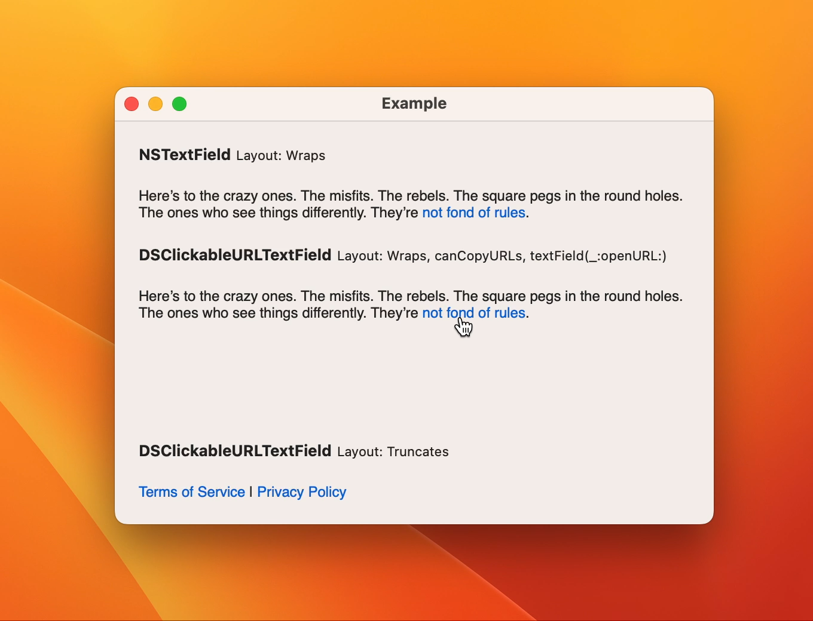

# DSClickableURLTextField

DSClickableURLTextField is a subclass of NSTextField that does one thing: allow links to be clicked on and opened.



To use this class, all you need to do is set the text field's attributed string value, with some portion of it being a link, and the text field will do the rest. You'll get the “pointy hand” cursor over the link, and clicking on it will open that link.

```swift
let termsAndPolicy = "[Terms of Service](https://example.com) | [Privacy Policy](https://example.com)"
do {
    label.attributedStringValue = try NSAttributedString(markdown: termsAndPolicy)
} catch {
}
```

Note that the class only works if it is non-editable and non-selectable. This is setup by default, but I wanted to mention it so nobody wastes time trying to figure out why the text field is acting the way it is.

Forked from [DSClickableURLTextField](http://www.nightproductions.net/developer.htm#DSClickableURLTextField)
